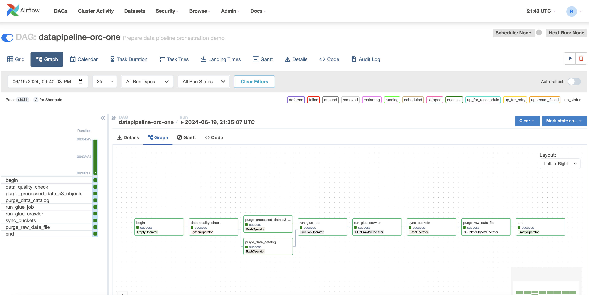

# Datapiepline orchestration and visualization for childcare centers in Toronto

## Overview
This project uses childcare center data from the Toronto City open portal and considers a situation where you want to check out the childcare centers near you. It considers when you need to initiate a data pipeline as soon as data arrives in an AWS S3 bucket. The data is then transformed and stored in an S3 curated bucket. Following this, the curated data is crawled and cataloged in an AWS Athena database table, enabling the execution of analytical queries without the need for manual intervention and using quicksight for visualization. This project uses a data pipeline using Amazon Managed Workflow for Apache Airflow (MWAA). The architecture for our use case is outlined below:

- The image provides an overview of the data and architecture for the project.
- It shows the flow of data from the raw data file in the landed-zone S3 bucket to the curated-data S3 bucket after going through the data pipeline.
- The data is then crawled and cataloged in an AWS Athena database table, enabling analytical queries.
- Finally, the curated data is visualized using Amazon QuickSight for data visualization.

### Implementation steps:

1. Created s3 buckets:
- curated-data: Store curated data in this folder
- dags: Store DAGs code
- landed-zone: Contains the raw data file to process
- scripts: To save AWS Glue job script(s)
- processed-data: To move the processed raw data files
- requirement: Contains DAG “requirement.txt” file

2. Configured MWAA: 
- IAM Role: IAM roles and policies to use with MWAA.
- S3 Bucket: S3 bucket to store DAGs, plugins, and other Airflow files.
- VPC and Subnet: To deploy an MWAA environment in a VPC and Subnet for secure and private network communication.
- Security Groups: security groups to control MWAA environment access.
- Monitoring and logging: Amazon CloudWatch to monitor and log your MWAA environment.

3. for the Glue part use the cloud formation template:
[stack_one.yaml](cloudformation/stack_one.yaml)

4. Data-transformation
You can find the code for the data transformation [here](src/code/data-transformation.py).
- The script starts by importing the necessary libraries: pandas for data manipulation and ast for converting strings to Python objects.
- It specifies the path to a CSV file and loads this file into a pandas DataFrame.
- The script drops the columns 'ward', 'PHONE', and 'run_date' from the DataFrame.
- The 'PCODE' column is modified by keeping only the first three characters of each entry.
- A function get_coordinates is defined. This function takes a string and an index as input attempts to convert the string to a Python object using ast.literal_eval, and then returns the coordinate at the specified index if it exists. If the string cannot be converted or the coordinate does not exist, the function returns None.
- The script applies the get_coordinates function to the 'geometry' column of the DataFrame to create two new columns: 'Longitude' and 'Latitude'.
- The 'geometry' column is dropped from the DataFrame.
- The 'PCODE' column is renamed to 'PostalCode'.
- Finally, the script writes the DataFrame to a new CSV file, without including the DataFrame's index. This results in a transformed version of the original data, with unnecessary columns removed, the 'PCODE' column simplified, and the 'geometry' column split into 'Longitude' and 'Latitude' columns.
You can find the image for the data and architecture [
.

5. Lambda function to trigger MWAA pipeline
- This Python script defines a Lambda function lambda_handler that triggers an Amazon Managed Workflows for Apache Airflow (MWAA) DAG (Directed Acyclic Graph) using the MWAA CLI (Command Line Interface).
- create_cli_token is a method from the AWS SDK (boto3) for Amazon MWAA.
- It's used to create a CLI token for a specified MWAA environment.
- This token is used to authenticate HTTP requests to the MWAA environment.
- In the script, it's used to get a token for triggering a DAG in the MWAA environment.
- The token is included in the Authorization header of the HTTP request.
[trigger_datapipeline.py](src/lambda/trigger_datapipeline.py)

6. Glue job:
- This Python script is an ETL (Extract, Transform, Load) job for AWS Glue. 
- Imports and Initializations: The script imports necessary modules and initializes AWS Glue and Spark contexts. It also retrieves job arguments and initializes the AWS Glue job.
- Data Extraction: The script reads a CSV file from an S3 bucket into a dynamic frame.
- Data Loading: The script writes the dynamic frame back to an S3 bucket in Glue Parquet format with gzip compression.
- Job Commit: The script commits the job, making it ready for execution.
- This script is used in data pipeline workflows to extract data from a source (S3 bucket), transform it (into a dynamic frame), and load it into a destination (S3 bucket in a different format).
- the result will be seen when the dag task is executed 

6. DAG
You can find the code for the DAG [here](src/dag/datapipeline-orc-one.py).
- The DAG is defined to orchestrate a data pipeline. Here's a brief explanation of each task in the DAG:
- begin: This is a task that signifies the start of the DAG.
- quality_check: This is a PythonOperator task that checks the quality of the data by verifying if a specific file exists in an S3 bucket. 
This is the first quality check in the pipeline, ensuring that the necessary data is present before proceeding with the rest of the tasks.
- purge_processed_data_s3_objects: This is a BashOperator task that purges (deletes) processed data from an S3 bucket. 
This is done to clean up any previously processed data before running the new data pipeline.
- purge_data_catalog: This is another BashOperator task that purges the data catalog in AWS Glue. 
This is done to ensure that the catalog is clean before running the new data pipeline.
- run_glue_job: This is a GlueJobOperator task that runs a Glue Job. AWS Glue is a fully managed extract, transform, and load (ETL) service that makes it easy to prepare and load your data for analytics.
- run_glue_crawler: This is a GlueCrawlerOperator task that runs a Glue Crawler. 
The crawler connects to the source or target data store, progresses through a prioritized list of classifiers to determine the schema for data, and then creates metadata tables in the AWS Glue Data Catalog.
- sync_buckets: This is a BashOperator task that syncs two S3 buckets. This is done to ensure that the processed data is available in the destination bucket.
- purge_raw_data_file: This is an S3DeleteObjectsOperator task that purges (deletes) the raw data file from the S3 bucket. This is done to clean up the raw data after it has been processed.
- quality_check_athena: This is another PythonOperator task that checks the quality of the data in Athena. It verifies if the table has columns 'Latitude' and 'Longitude'. This is the final quality check in the pipeline, ensuring that the processed data is as expected.
- end: This is a dummy task that signifies the end of the DAG.

The chain function is used to define the dependencies between these tasks, i.e., the order in which they should be executed. The quality checks are placed at the start and end of the pipeline to ensure data check before and after the data processing tasks.

7. Utilized Quicksight for data visualization, which allows for detailed exploration of each query through drill-down or drill-up operations:
- Displaying the top 20 results for the sum of Igspace, categorized by Longitude and Latitude, and the top 18 results by Qcode.
- Displaying the top 20 results for the sum of Pgspace, categorized by Longitude and Latitude, and the top 18 results by Qcode.
- Displaying the top 20 results for the sum of Kgspace, categorized by Longitude and Latitude, and the top 18 results by Qcode.
- Displaying the top 20 results for the sum of Totspace, categorized by Longitude and Latitude, and the top 18 results by Qcode.

	

	

